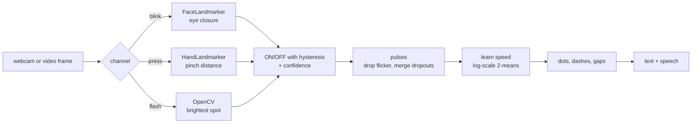

# Silent Signal

**Talk without sound.** Blink, touch your fingertips together, or flash a
light, and Silent Signal reads it as Morse code and turns it into text and
speech, live from a webcam or from a recorded video. For people who cannot
speak (after a stroke, on a ventilator, with ALS) or in places where you
cannot make a sound.

**Live demo: https://vivekvagale.github.io/silent-signal/** : runs in your
browser; camera frames never leave your device. No camera? Open *Analyze
video* and press *Blink sample* or *Flash sample*. Both clips are synthetic:
a computer-generated MakeHuman face (CC0) blinking "SOS HELP", and a rendered
torch. Both decode exactly, and a test checks it
([how the blink clip is made](tools/blink_sample/README.md)).

## Channels

| Channel | How to signal | How it is detected |
|---|---|---|
| Eye blink | short blink = dot, long blink = dash | MediaPipe FaceLandmarker blendshapes (eye closure 0-1, both eyes) |
| Finger press | index fingertip touches thumb: short = dot, long = dash | MediaPipe HandLandmarker, fingertip distance / hand size |
| Light flash | torch or phone light: short = dot, long = dash | OpenCV: brightest spot after a light blur, adaptive dark/bright levels |
| Hand gesture | hold 👍 👎 ✋ ✌️ ☝️ ✊ 🤟 for 1 s to type a word | MediaPipe GestureRecognizer (7 built-in gestures) |

The gesture channel is a set of word shortcuts, **not sign language**.
Recognising a sign-language alphabet needs a model trained on sign data;
the channel interface is ready for one.

## Results

`python -m silent_signal.benchmark` : synthetic tests with known ground truth.
Metric: character error rate (CER), lower is better.

**Timing decoder**: 300 random messages per row, sent at speeds from a fast
tapper (0.12 s dots) to a slow blinker (0.45 s dots), with every on/off
duration randomly stretched or shrunk ("timing wobble").

| Timing wobble | Learned speed (this project) | Fixed speed |
|---|---|---|
| none | **0.000** | 0.241 |
| 15% | **0.005** | 0.547 |
| 30% | **0.338** | 0.856 |
| 45% | **0.783** | 1.072 |

**Flash video**: 20 rendered clips per row of a small torch flashing Morse
in a noisy room whose light level drifts 30% brighter, decoded frame by frame
by the real detector.

| Frame rate | CER | Exact messages |
|---|---|---|
| 15 fps | 0.004 | 19 / 20 |
| 30 fps | 0.004 | 19 / 20 |

**Slow, deliberate pauses**: 300 messages where every pause is 2.5x longer
than Morse allows (how people actually blink on purpose), 15% wobble.

| Pauses | CER |
|---|---|
| standard Morse gap rules | 2.787 (over 1: every letter split apart adds characters) |
| gap groups learned from the pauses (this project) | **0.063** |

**What these numbers do not cover**: blinks and finger presses need real
people on camera; they are not simulated. They were checked by hand, not
measured. Above ~25% timing wobble errors climb fast, because single
dot/dash and gap decisions start to flip; the fix is word-level correction
with a dictionary (next step).

### A real test: Jeremiah Denton, 1966

In a 1966 propaganda interview filmed in Hanoi, US Navy pilot Jeremiah
Denton, a prisoner of war, blinked T-O-R-T-U-R-E in Morse while answering
questions. I ran the blink analyzer on a 41 s news clip of it (320x240, 15 fps; the clip is not
in this repo, only the measured blink timings in
[tests/fixtures/denton_pulses.json](tests/fixtures/denton_pulses.json)).

- **The clip is edited**: 8 cuts, two cutaways to the interviewer and wide
  shots. Only 13 s (1.9-14.7 s) is one continuous close-up, so the full word
  is never on screen in one piece. The analyzer now finds cuts and treats
  them honestly (below); before that it read a 5.3 s "dash" that was really
  4 s of cutaway.
- **What it reads in that close-up**: `---- ... - -`, against the truth
  `- --- .-. - ..- .-.` (TORTUR, then the cut). T, O and the second T are
  read as the right marks; it fails because his pause after T (0.33 s) is as
  short as the pauses inside O, and at 15 fps his short and long blinks for
  R and U overlap. Output: `?STT`, not TORTUR. That is a known failing test
  (`xfail`), kept so a future fix shows up.
- After fixing the analyzer's frame reading and calibration, it reads 15
  marks (truth: 15) instead of 18.

## Analyzing recorded video

- **Every frame is read.** The browser seeks frame by frame at 20 fps and
  waits for each frame to be on screen. Playing the clip and reading what
  arrived caught only 97 of 616 frames on a slow laptop.
- **Calibrated per video.** Old film read 0.44 "closure" with eyes open, so
  fixed thresholds fail. Open = 35th percentile of eye closure, closed = 99th;
  a sensitivity slider moves the switch point between them.
- **Close-up faces.** MediaPipe's face detector misses faces that fill the
  frame; those frames are retried shrunk into a black border (face found in
  50% -> 100% of frames on a close-up test clip, an AI-generated video).
- **Edits and lost faces.** A big jump in the picture between frames is a
  cut. A signal touching a cut, or a stretch of more than 0.25 s with no
  face, has unknown length, so it is dropped; a cut always ends the word and
  its "pause" is not used to learn timing.
- **Decoded live.** The message types itself out while the clip is read,
  as in live camera mode (thresholds from the frames seen so far), then is
  recalibrated on the whole clip at the end. Replay types it out again in
  step with the video.
- **Review and correct.** Replay the clip with the signals marked, click a
  row or the timeline to jump there, flip a dot/dash, delete a signal or add
  one where it was missed.

## How it works



- **Every channel follows one contract**: a detector reads a frame and
  returns `{on, confidence, value}`. Timing, Morse and text are shared. A new
  channel is one class plus a registry line
  ([silent_signal/detectors/base.py](silent_signal/detectors/base.py)).
- **Speed is learned, on a log scale**: human timing errors are proportional,
  so dot/dash and gap thresholds sit at geometric midpoints (√3 ≈ 1.73 units,
  √21 ≈ 4.58 units) and the unit is learned per sender with 1-D k-means on
  log durations.
- **Hysteresis** (separate switch-on and switch-off levels) stops the signal
  chattering when a measurement hovers near the threshold.
- **Arm / pause** (Space): natural blinks would otherwise type dots.
- The browser app ([web/](web/)) re-implements the same engine in JavaScript
  and runs MediaPipe's WebAssembly build.

Design decisions and what went wrong: [docs/INTERVIEW_NOTES.md](docs/INTERVIEW_NOTES.md).

## Run it

```powershell
uv venv --python 3.11 .venv
.venv\Scripts\activate
uv pip install -r requirements.txt

python -m silent_signal.analyze clip.mp4 --channel flash      # or blink / tap; --json out.json
python -m silent_signal.benchmark                             # the numbers above
python -m pytest
python -m http.server 8000 --directory web                    # the browser app on localhost:8000
```

MediaPipe models (4-8 MB each) download on first use.

## Author

**Vivek Vagale** - [@VivekVagale](https://github.com/VivekVagale)
